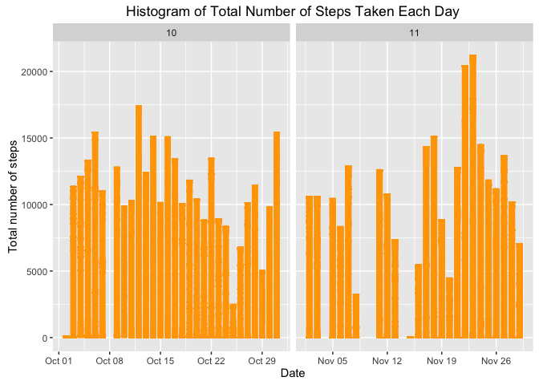
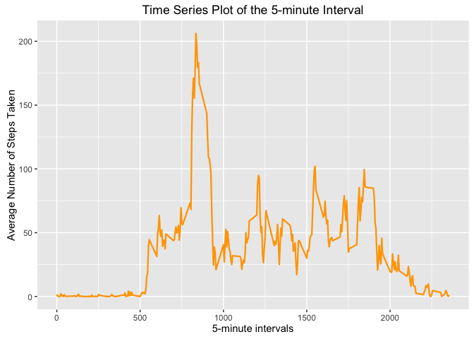
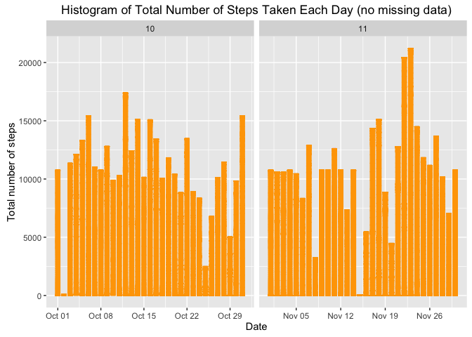

# Reproducible Research: Peer Assessment 1

## Loading and preprocessing the data


```r
echo = TRUE
unzip("activity.zip")
data <- read.csv("activity.csv", colClasses = c("integer", "Date", "factor"))
data$month <- as.numeric(format(data$date, "%m"))
data2 <- na.omit(data)
rownames(data2) <- 1:nrow(data2)
head(data2)
```

```
##   steps       date interval month
## 1     0 2012-10-02        0    10
## 2     0 2012-10-02        5    10
## 3     0 2012-10-02       10    10
## 4     0 2012-10-02       15    10
## 5     0 2012-10-02       20    10
## 6     0 2012-10-02       25    10
```

```r
dim(data2)
```

```
## [1] 15264     4
```

## What is mean total number of steps taken per day?

```r
library(ggplot2)
ggplot(data2, aes(date, steps))+
geom_bar(stat = "identity", colour = "orange", fill = "orange", width = 0.7)+
facet_grid(. ~ month, scales = "free")+
labs(title = "Histogram of Total Number of Steps Taken Each Day", x = "Date", y = "Total number of steps")
```

<!-- -->


```r
stepday <- aggregate(data2$steps, list(Date = data2$date), FUN = "sum")$x
mean(stepday)
```

```
## [1] 10766.19
```

```r
median(stepday)
```

```
## [1] 10765
```

## What is the average daily activity pattern?

```r
stepavg <- aggregate(data2$steps, list(interval = as.numeric(as.character(data2$interval))), FUN = "mean")
names(stepavg)[2] <- "meanOfSteps"
```


```r
ggplot(stepavg, aes(interval, meanOfSteps)) + geom_line(color = "orange", size = 0.8) + labs(title = "Time Series Plot of the 5-minute Interval", x = "5-minute intervals", y = "Average Number of Steps Taken")
```

<!-- -->


```r
stepavg[stepavg$meanOfSteps == max(stepavg$meanOfSteps), ]
```

```
##     interval meanOfSteps
## 104      835    206.1698
```

## Imputing missing values


```r
sum(is.na(data))
```

```
## [1] 2304
```

```r
datanew <- data 
for (i in 1:nrow(datanew)) {
    if (is.na(datanew$steps[i])) {
        datanew$steps[i] <- stepavg[which(datanew$interval[i] == stepavg$interval), ]$meanOfSteps
    }
}

head(datanew)
```

```
##       steps       date interval month
## 1 1.7169811 2012-10-01        0    10
## 2 0.3396226 2012-10-01        5    10
## 3 0.1320755 2012-10-01       10    10
## 4 0.1509434 2012-10-01       15    10
## 5 0.0754717 2012-10-01       20    10
## 6 2.0943396 2012-10-01       25    10
```

```r
sum(is.na(datanew))
```

```
## [1] 0
```


```r
ggplot(datanew, aes(date, steps)) +
geom_bar(stat = "identity",colour = "orange",fill = "orange",width = 0.7) +
facet_grid(. ~ month, scales = "free") +
labs(title = "Histogram of Total Number of Steps Taken Each Day (no missing data)", x = "Date", y = "Total number of steps")
```

<!-- -->


```r
stepdaynew <- aggregate(datanew$steps,list(Date = datanew$date),FUN = "sum")$x
meannew <- mean(stepdaynew)
meannew
```

```
## [1] 10766.19
```

```r
mediannew <- median(stepdaynew)
mediannew
```

```
## [1] 10766.19
```

```r
meanold <- mean(stepday)
medianold <- median(stepday)
meannew - meanold      
```

```
## [1] 0
```

```r
mediannew - medianold
```

```
## [1] 1.188679
```

## Are there differences in activity patterns between weekdays and weekends?


```r
head(datanew)
```

```
##       steps       date interval month
## 1 1.7169811 2012-10-01        0    10
## 2 0.3396226 2012-10-01        5    10
## 3 0.1320755 2012-10-01       10    10
## 4 0.1509434 2012-10-01       15    10
## 5 0.0754717 2012-10-01       20    10
## 6 2.0943396 2012-10-01       25    10
```

```r
datanew$weekdays <- factor(format(datanew$date, "%A"))
levels(datanew$weekdays)
```

```
## [1] "Friday"    "Monday"    "Saturday"  "Sunday"    "Thursday"  "Tuesday"  
## [7] "Wednesday"
```

```r
levels(datanew$weekdays) <- list(weekday = c("Monday", "Tuesday",
                                             "Wednesday", 
                                             "Thursday", "Friday"),
                                 weekend = c("Saturday", "Sunday"))
levels(datanew$weekdays)
```

```
## [1] "weekday" "weekend"
```

```r
table(datanew$weekdays)
```

```
## 
## weekday weekend 
##   12960    4608
```


```r
stepavg <- aggregate(datanew$steps, 
                      list(interval = as.numeric(as.character(datanew$interval)), 
                           weekdays = datanew$weekdays),
                      FUN = "mean")
names(stepavg)[3] <- "meanOfSteps"
library(lattice)
xyplot(stepavg$meanOfSteps ~ stepavg$interval | stepavg$weekdays, 
       layout = c(1, 2), type = "l", 
       xlab = "Interval", ylab = "Number of steps")
```

<!-- -->


